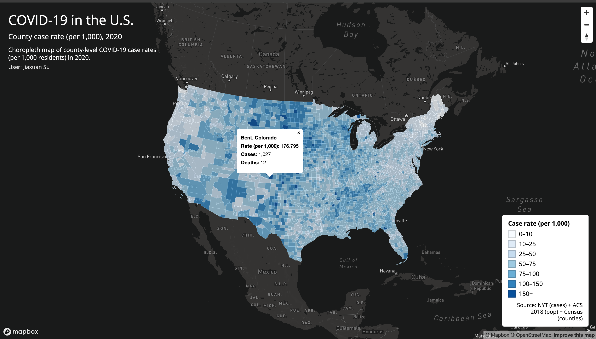
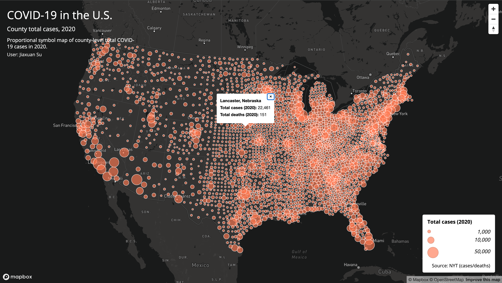

# COVID-19 County Maps (U.S., 2020)

Hi! This project is my Lab 03 deliverable for GEOG 458. I built two interactive web maps that visualize COVID-19 patterns across U.S. counties in 2020. One map focuses on **case rates** (cases per 1,000 residents) using a **choropleth**, and the other shows **total case counts** using **proportional symbols**.

## Live Maps
- **Map 1 (Choropleth — Case Rates):** https://YOUR_GITHUB_USERNAME.github.io/YOUR_REPOSITORY_NAME/map1.html  
- **Map 2 (Proportional Symbols — Total Cases):** https://YOUR_GITHUB_USERNAME.github.io/YOUR_REPOSITORY_NAME/map2.html  

## Screenshots
(Add your screenshots to the `img/` folder and update the filenames below.)
- Map 1: `img/map1.png`  
- Map 2: `img/map2.png`

  


## What’s in this project

### Map 1 — Choropleth (Rates)
- Shows county-level COVID-19 case rates (cases per 1,000 residents) in 2020
- Uses a color ramp to display low → high rates
- Click a county to view a popup with the county name and rate

### Map 2 — Proportional Symbols (Counts)
- Shows county-level total COVID-19 case counts in 2020
- Uses circle size to represent the number of cases
- Click a circle to view a popup with the county name and total cases

## Primary functions (including what wasn’t covered much in lecture)
- Interactive popups for both maps (click to view values)
- Custom legends:
  - Choropleth legend with color swatches + value ranges
  - Proportional symbol legend with scaled circles
- Albers projection on both maps (not the default web map projection)
- Clean map UI: title, subtitle, short description, user name, and sources displayed on the map

## Libraries
- Mapbox GL JS (interactive mapping)
- Google Fonts (Open Sans) (typography)
- Mapshaper (shapefile → GeoJSON conversion + simplification)
- GitHub Pages (hosting)

## Data sources
- COVID-19 case/death data (2020): The New York Times (processed for this lab)
- Population data (for rates): 2018 ACS 5-year estimates (processed for this lab)
- County boundaries: U.S. Census Bureau (processed for this lab)

## File structure
```text
YOUR_REPOSITORY_NAME
│  map1.html
│  map2.html
│  readme.md
├─assets
│    us-covid-2020-counts.geojson
│    us-covid-2020-rates.geojson
├─css
│    style.css
├─img
│    map1.png
│    map2.png
└─js
     main.js
